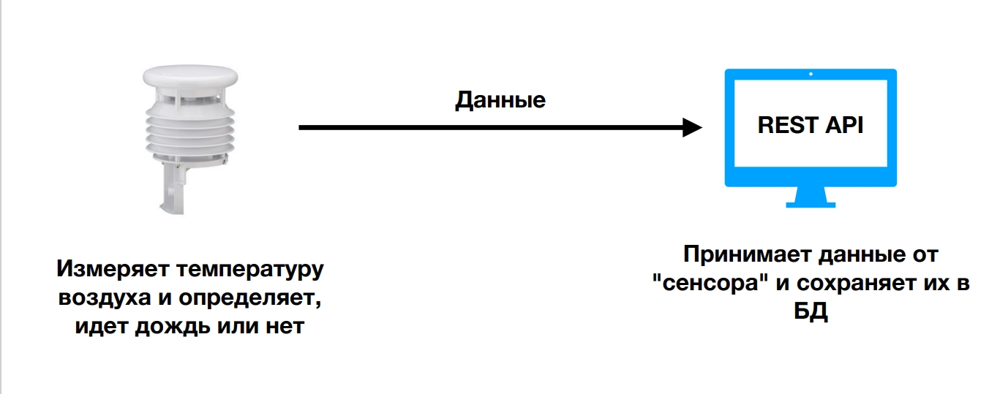
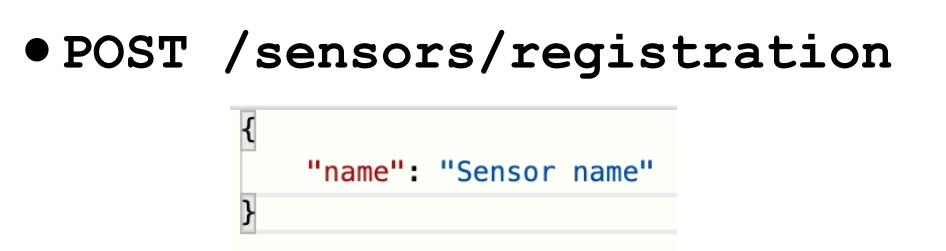
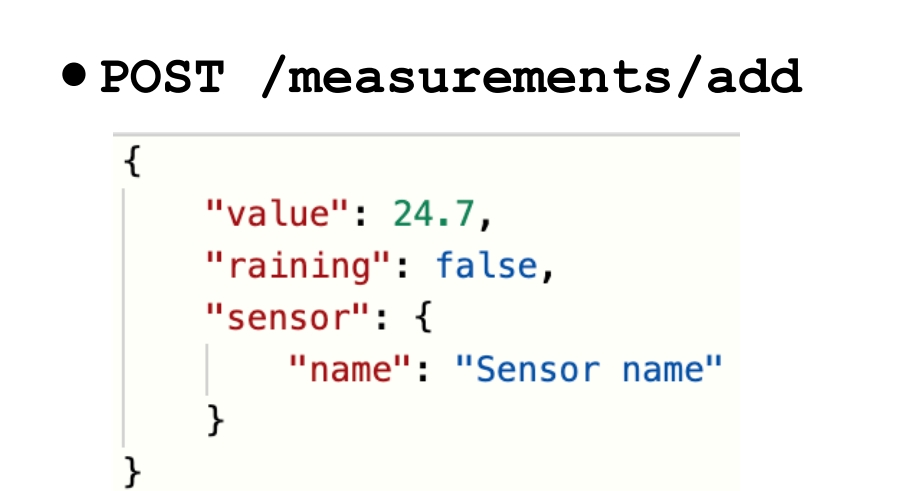
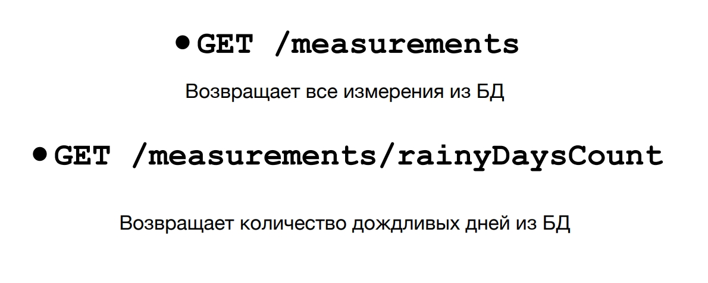

## 3/3 проектов по курсу Наиля Алишева
[Проект 1](https://github.com/19Turboboy90/library-of-books-project1)
[Проект 2](https://github.com/19Turboboy90/library-of-books-project2)

[Полный курс по Spring (Hibernate, JPA, Boot, REST, Security, JWT)](https://swiftbook.org/courses/438/show_promo/)

REST API - сервисы нужны практически в любой сфере деятельности.
Большинство программистов по всему миру преимущественно
занимаются тем, что создают REST API сервисы различных уровней
сложности.
REST API позволяет принимать данные с любого устройства,
которое имеет выход в интернет (сенсор, робот, весы, конвейер,
сканер штрих кодов, мобильный телефон, ... что угодно) и как-то
их обрабатывать.
Мы можем сами посылать запросы к сторонним REST API сервисам
(с помощью RestTemplate или WebClient - новый класс,
позволяет совершать асинхронные запросы) либо создавать свой
REST API сервис, который может принимать запросы от клиентов.

Представьте, что вы приобрели метеорологический датчик (для
простоты дальше будем называть его просто "сенсор"). Этот сенсор
измеряет температуру окружающего воздуха и может определять,
идет дождь или нет.

Мы хотим получать данные с сенсора и сохранять их в БД, чтобы
далее их анализировать.

Создать REST API сервис, который будет принимать данные от
"сенсора".

Сенсор имеет доступ в интернет, поэтому может отправлять HTTP запросы к
нашему серверу.
Каждый раз, когда он будет производить измерение, он будет отправлять HTTP
запрос с данными в формате JSON на наш сервер - для этого в реальной жизни
мы бы указали устройству IP адрес того компьютера, где мы запускаем Spring
REST API приложение. После этого, на нашем компьютере мы сможем
принимать запросы от сенсора.

Регистрирует новый сенсор в системе. Другими словами, просто добавляет новый
сенсор в таблицу сенсоров в БД.
Также, вы должны валидировать то, что сенсора с таким названием еще нет в БД. Если сенсор с таким названием есть в БД -
возвращать
клиенту сообщение с ошибкой.
Также, если название сенсора пустое или содержит менее 3 или более 30 символов,
клиенту должно возвращаться сообщение с ошибкой.

Добавляет новое измерение. Это тот адрес, куда настоящий сенсор посылал бы свои данные.
Вещественное поле "value" содержит значение температуры воздуха, булево поле "raining" содержит
значение true/false в зависимости от того, зарегистрировал ли сенсор дождь или нет. Помимо этого, в
этом запросе передается сам объект сенсора, который получил и отправляет эти "измерения".
Значения температуры воздуха, дождя должны сохранятся в таблице в БД. Также, в каждой строке этой
таблицы должно содержаться название того сенсора, который прислал эти измерения. То есть
сущность "Измерение" имеет связь с сущностью "Сенсор".
Все поля у измерения должны валидироваться.
Значение "value" должно быть не пустым и находиться в диапазоне от -100 до 100.
Значение "raining" должно быть не пустым.
Значение "sensor" должно быть не пустым. При этом, название сенсора должно валидироваться в БД.
Сенсор с таким названием должен быть зарегистрирован в системе (должен быть в БД).
Если такого сенсора нет в БД - выдавать ошибку. На сервере, у измерения должно выставляться текущее время, оно должно
сохраняться в БД.

Всего в приложении должно быть 4 адреса:

1) Регистрация сенсора

2) Добавление измерения от сенсора

3) Получение всех измерений

4) Получение количества дождливых дней

#### Используемы технологии

- Spring Boot
- Spring Data JPA (Hibernate)
- Spring Validator
- Postgres
- Lombok
